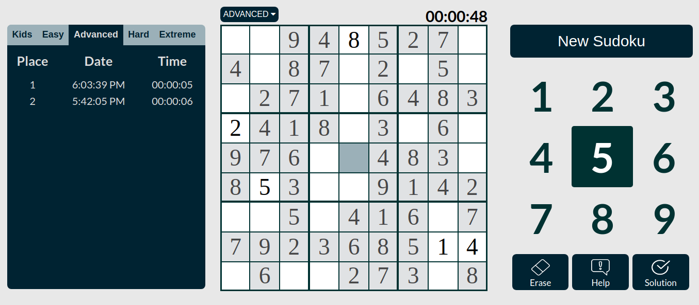
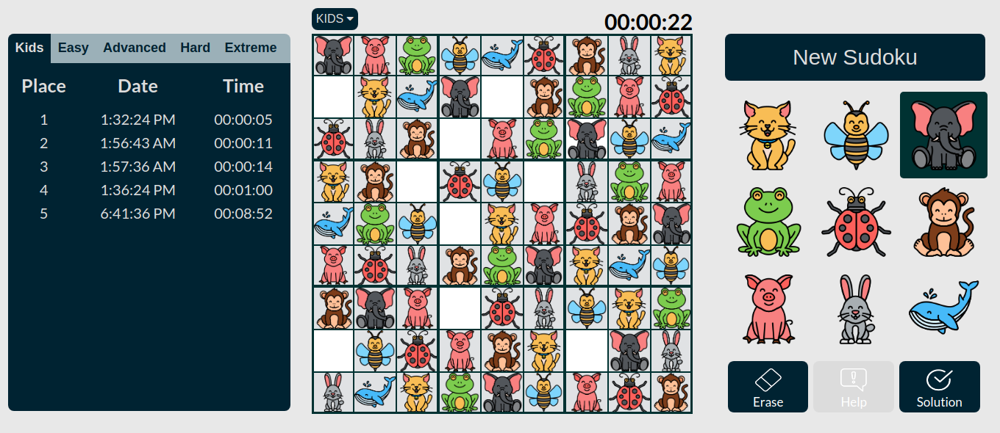
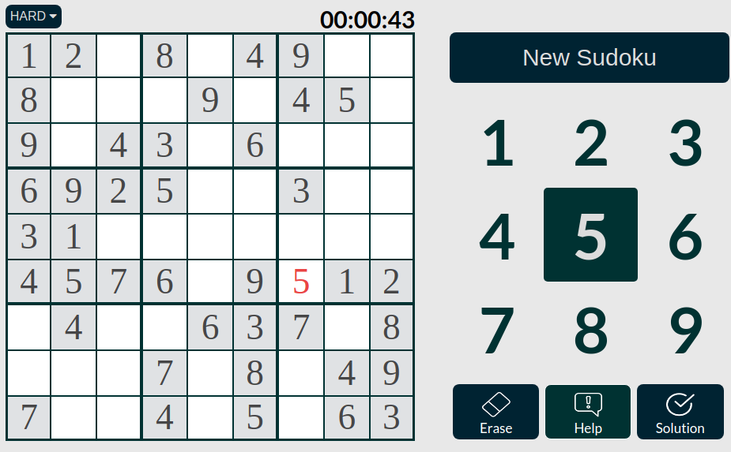
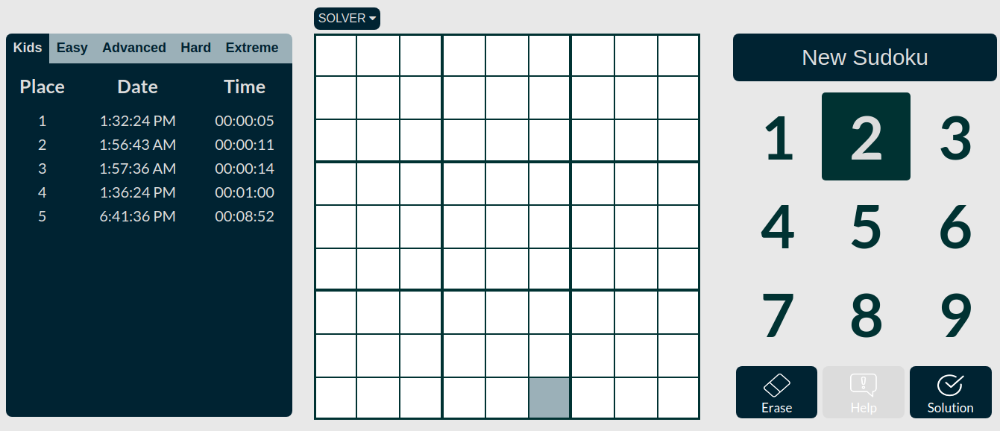
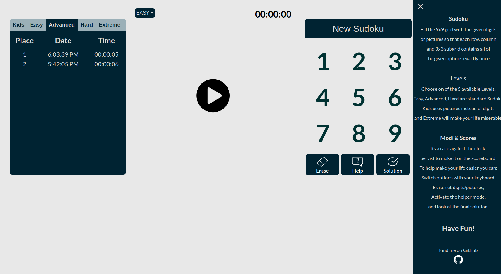

# Sudoku
Passionate Sudoku-Solvers await 5 different Levels to test their skills and a Sudoku Solver to find the right solution to even the most difficult Sudoku-Boards.

This Sudoku-Game-Engine and Solver uses an extremly fast backtracking algorithm, generating and solving sudokus in mere miliseconds.

It is written in Typescript, build with Parcel-Bundler, styled with Sass and testet with Jest.

 
 
 ---
 ### Levels
 
 You can choose one of 5 Levels. Easy, Advanced and Hard are Standard Sudoku-Boards with varying difficulty.
 
 Those daring to play Level Extreme await an ever-changing board and strobo-effect alongside the disabled helper-mode, to guarantee a challenging and fun time.
 
 Kids Level uses cute pictures of animals instead of digits and is perfect for young children.
 
 
 
 ---
 ### Helper Mode
 
 If the Sudoku turns out to be a bit more difficult than expected, you can turn on Helper Mode.
 
 The Helper Mode, while activated, highlights the numbers you set in the wrong square as you go.
 
  
  
  ---
  ### Sudoku Solver
  
  You found a Sudoku without a Solution provided but would like to know it?
  
  With the Sudoku-Solver you can create a Sudoku-Board and let the Solver solve it for you.
  
   
   
   ---
   
  ### Futher Information
  
  The Sidemenu provides a quick explanation of everything and recaps what a sudoku actually is. In case you forgot how to play Sudoku, i guess 😆
  
  
  
  ---
  ###### ! Difficulty levels depend solely on the number of empty squares. There is no further algorithm rating the difficulty of the generated Sudoku-Boards.